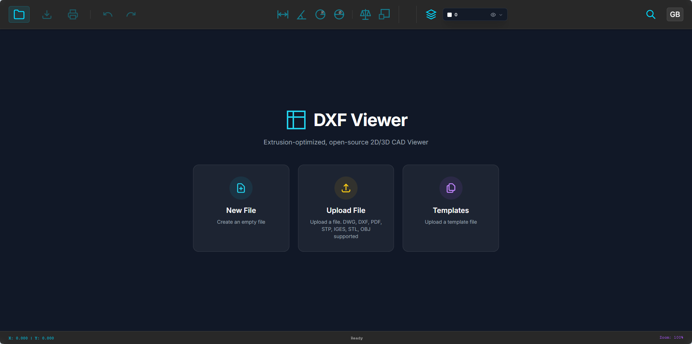

# DXF Viewer

A powerful, web-based DXF file viewer built with Vanilla JavaScript and HTML5 Canvas. This application allows users to view, analyze, and measure AutoCAD DXF files directly in the browser with a modern, dark-themed UI.

 *<!-- Replace with actual screenshot -->*

## Features

### 🔍 Viewing & Navigation
- **High-Performance Rendering**: Efficiently renders complex DXF drawings using HTML5 Canvas.
- **Zoom & Pan**: Smooth zooming and panning capabilities.
- **Zoom Tools**:
  - **Zoom Extents**: Instantly fit the entire drawing to the screen.
  - **Zoom Window**: Draw a rectangle to zoom into a specific area.
- **Layer Management**: Toggle visibility of individual layers with a color-coded panel.

### 📐 Measurements & Analysis
- **Advanced Snapping (OSNAP)**: Intelligent object snapping to Endpoints, Midpoints, Centers, Intersections, and Nearest points.
- **Measurement Tools**:
  - **Distance**: measure length between two points.
  - **Angle**: Measure angle between two lines or 3 points.
  - **Radius/Diameter**: Measure circles and arcs.
  - **Area**: Calculate area of closed loops, polylines, and circles.
- **Smart Tracking**: Virtual guides for horizontal, vertical, and perpendicular alignments.

### 🛠 Tools & UI
- **Entity Tree**: Hierarchical view of drawing entities (Blocks, Polylines, Layers) with "Eye" toggles.
- **Property Inspector**: View detailed properties (Coordinates, Length, Layer, etc.) of selected objects.
- **Multi-Language Support**: Fully localized interface (English & Turkish).
- **Dark Mode**: Sleek, professional dark interface optimized for CAD workflows.

## Installation & Usage

1. **Clone the repository:**
   ```bash
   git clone https://github.com/ufukizgi/dxf-viewer.git
   ```

2. **Serve the application:**
   Because this app uses ES6 modules and fetches local files, it must be served via a local HTTP server (not `file://`).

   **Using Python:**
   ```bash
   cd dxf-viewer
   python -m http.server 8080
   ```

   **Using Node/NPM (http-server):**
   ```bash
   npx http-server .
   ```

3. **Open in Browser:**
   Navigate to `http://localhost:8080` in your web browser.

## Technologies

- **Core**: HTML5, CSS3 (Tailwind CSS), JavaScript (ES6+)
- **Parsing**: [dxf-parser](https://github.com/gdsestimating/dxf-parser)
- **Rendering**: Custom Canvas 2D Renderer

## License

[MIT](LICENSE)
