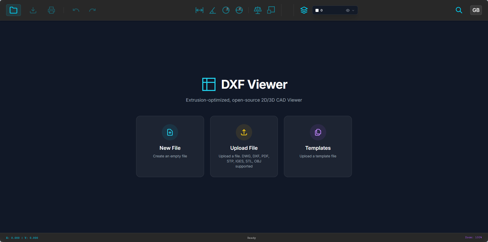

# DXF Viewer

A powerful, web-based DXF/DWG file viewer built with Three.js and Vanilla JavaScript. This application allows users to view, analyze, measure, and calculate weights for AutoCAD files directly in the browser with a modern, dark-themed UI.

[**🚀 Live Demo**](https://izgi.me/cad)

 *<!-- Replace with actual screenshot -->*

## Features

### 📂 File Management
- **Multi-Tab Support**: Work with multiple DXF/DWG/PDF files simultaneously in separate tabs.
- **DWG Conversion**: Automatic conversion of DWG files to DXF format via cloud API.
- **PDF Import**: Import vector PDF files and automatically convert them to editable vector lines.
- **Drag & Drop**: Simply drag and drop files to open them.
- **Template Library**: Load pre-defined templates for quick access to common shapes and components.
- **Start Page**: Clean welcome screen with quick access to new files, templates, and file uploads.

### 🔍 Viewing & Navigation
- **3D Rendering**: High-performance rendering using Three.js WebGL renderer.
- **Orthographic Camera**: CAD-optimized orthographic projection for accurate measurements.
- **Zoom & Pan**: Smooth zooming (mouse wheel) and panning (middle-click drag).
- **Zoom Extents**: Instantly fit the entire drawing to the screen.
- **Layer Management**: Toggle visibility of individual layers with a color-coded panel.
- **Background Color**: Switch between dark and light backgrounds.

### 📐 Measurements & Analysis
- **Advanced Snapping (OSNAP)**: Intelligent object snapping to:
  - Endpoints
  - Midpoints
  - Centers (for arcs and circles)
  - Intersections
  - Nearest points
- **Measurement Tools**:
  - **Linear Distance**: Measure length between two points with OSNAP support.
  - **Angle**: Measure angle between two lines.
  - **Radius**: Measure radius of circles and arcs with dynamic arrow placement.
  - **Diameter**: Measure diameter of circles and arcs.
- **Persistent Measurements**: Measurements remain visible and are saved per tab.
- **Scaled Measurements**: Automatically accounts for object scaling and transformations.
- **Tab-Isolated Measurements**: Each tab maintains its own set of measurements.

### ⚖️ Weight Calculation
- **Material Database**: Comprehensive database of materials (Steel, Aluminum, Stainless Steel, etc.).
- **Temper & Pres Selection**: Choose specific material properties and processing methods.
- **Figure Types**: Support for different cross-section shapes (rectangular, circular, etc.).
- **Thickness Input**: Specify material thickness for accurate weight calculations.
- **Floating Info Tables**: Dynamic info tables attached to selected geometries showing:
  - Dimensions (width, height, radius, etc.)
  - Weight calculations
  - Material properties
- **Print Selection**: Select and print specific geometries with their weight information.

### 📋 Clipboard & Templates
- **Clipboard Manager**: Copy, paste, and manage drawing elements.
- **Template Placement**: Place template geometries with:
  - **Scaling**: Adjust size using mouse wheel
  - **Rotation**: Rotate using Ctrl + mouse wheel
  - **Visual Preview**: See the template before placing it
- **Scale Panel**: Real-time display of current scale and rotation values.

### 🛠 Tools & UI
- **Property Inspector**: View detailed properties (Coordinates, Length, Layer, etc.) of selected objects.
- **Multi-Language Support**: Fully localized interface (English & Turkish).
- **Undo/Redo**: Full command history with undo/redo support.
- **Keyboard Shortcuts**:
  - `ESC`: Cancel current operation or deselect
  - `Delete`: Delete selected objects
  - `Ctrl+C`: Copy selection
  - `Ctrl+Z`: Undo
  - `Ctrl+Y`: Redo

## Installation & Usage

1. **Clone the repository:**
   ```bash
   git clone https://github.com/ufukizgi/dxf-viewer.git
   ```

2. **Serve the application:**
   Because this app uses ES6 modules and fetches local files, it must be served via a local HTTP server (not `file://`).

   **Using Python:**
   ```bash
   cd dxf-viewer
   python -m http.server 8080
   ```

   **Using Node/NPM (http-server):**
   ```bash
   npx http-server .
   ```

3. **Open in Browser:**
   Navigate to `http://localhost:8080` in your web browser.

## Technologies

- **Core**: HTML5, CSS3 (Tailwind CSS), JavaScript (ES6+)
- **3D Rendering**: [Three.js](https://threejs.org/) with OrbitControls
- **Parsing**: [dxf-parser](https://github.com/gdsestimating/dxf-parser)
- **DWG Conversion**: Cloud-based conversion API

## Project Structure

```
dxf-viewer/
├── index.html              # Main HTML file
├── styles.css              # Global styles and theme
├── src/
│   ├── main.js            # Application entry point
│   ├── scene-viewer.js    # Three.js scene management
│   ├── dxf-loader.js      # DXF parsing and entity generation
│   ├── measurement-manager.js  # Measurement tools
│   ├── weight-manager.js  # Weight calculation system
│   ├── tab-manager.js     # Multi-tab functionality
│   ├── clipboard-manager.js    # Clipboard operations
│   ├── snapping-manager.js     # OSNAP system
│   ├── localization.js    # Multi-language support
│   └── ...
└── README.md
```

## License

[MIT](LICENSE)
